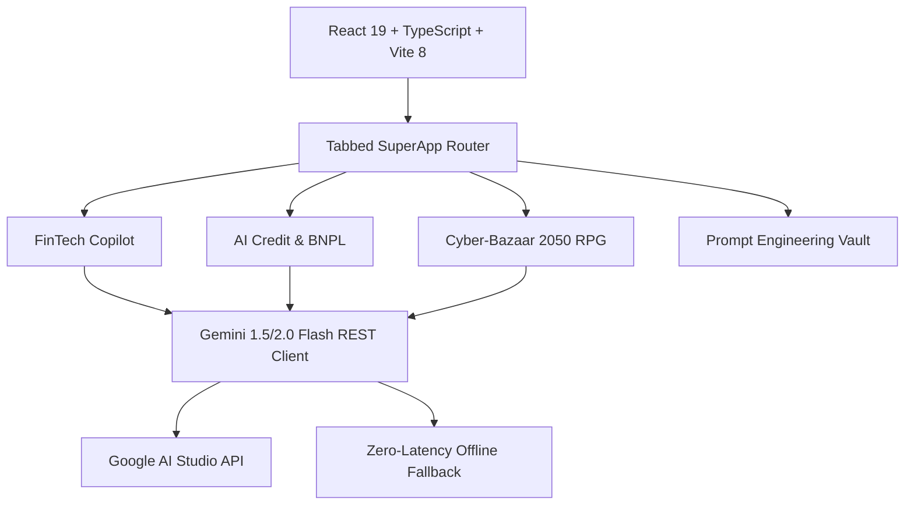

# 🦄 UnicornX: Gemini Next-Gen FinTech & Cyber-Bazaar Ecosystem

[](https://ictweek.uz)
[](https://aistudio.google.com)
[](https://react.dev)
[](https://tailwindcss.com)

> **UnicornX (FinGemini 2026)** — Central Asia's next-generation AI SuperApp & FinTech engine built for **ICT Week Uzbekistan 2026 (Tashkent CAEx)**. Combines the market dominance of **Uzum Bank** and **TBC Bank** with the multimodal reasoning of **Google Gemini 2.0 / 1.5 Flash**.

---

## 🌟 Core Modules

### 1. 🧾 Multimodal FinTech Copilot (Zero-Hallucination OCR)
- **Real-Time Receipt Extraction**: Instant extraction of items, prices in UZS, VAT (QQS), and categories from grocery (Korzinka), electronics (Uzum Market), and dining receipts (Click/Payme).
- **Proactive Budget Intelligence**: Analyzes spending habits and calculates potential annual savings.
- **Uzbek & English Web Speech**: Voice synthesis assistant giving conversational advice in Uzbek, Russian, and English.

### 2. 💳 AI Credit & 0-0-12 Installment Engine (Uzum Nasiya & TBC Standard)
- **Algorithmic Underwriter**: Instant calculation of credit scores (300 to 850) based on DTI (Debt-to-Income), stability, and payment history.
- **0-0-12 BNPL Simulator**: 1-second installment approval with zero margin interest for top-tier borrowers.
- **Click & Uzum Bank Card Integration**: Direct simulated payout to local cards.

### 3. 🎮 Cyber-Bazaar 2050: Silk Road (Procedural Gemini Game)
- **Autonomous AI NPCs**:
  - **Akram aka** — Veteran Chorsu cyber-merchant who loves authentic Tashkent bargaining.
  - **Sora 2.0** — High-tech AI underwriter from TBC-2050 offering liquidity and crypto-bonds.
  - **Mayor Rustam** — Strict customs officer regulating transit permits.
- **Dynamic Economy**: Real-time bargaining, fluctuating reputation, inventory system, and Cyber-Som currency.

### 4. ⚡ Master Prompt Engineering Vault
- Curated collection of production-grade system prompts based on **School 21** methodology (`KIM SIZ` / `NIMA KERAK` / `KIM UCHUN` / `FORMAT`) and Silicon Valley Y Combinator standards.
- 1-Click copy to clipboard for rapid prototyping.

### 5. 🕹️ Nexus Arcade: Open Web & AI Game Universe ("Put Your Game")
- **Instant Play Built-In Games**:
  - **3D Cyber Runner (WebGL PBR Engine)**: 60 FPS parkour across futuristic Tashkent skyscrapers.
  - **2D Retro Platformer Quest**: Classic multi-level jumping adventure with collectible crystals and enemies.
  - **Neon Starfighter (Bullet Blitz)**: High-speed canvas space shooter with particles and boss battles.
  - **Quantum 2048**: Addictive cyberpunk puzzle game with sound synthesis.
  - **Cyber-Bazaar 2050**: Gemini procedural negotiation RPG.
- **Creator Studio ("Put Your Game Into The Website")**:
  - Anyone can submit their game via Web URL (itch.io, Poki, Vercel) or raw single-file HTML5/JS/Canvas code.
  - **Gemini AI Prompt Game Generator**: Type any idea (e.g. *"Flappy Falcon dodging Tashkent TV Tower"*), and Gemini generates a full playable HTML5 game in 5 seconds!
- **Gamification**: Player XP Leveling, Daily Quests, and Global Leaderboard.

---

## 🏗️ System Architecture



---

## 🚀 Quick Start

### Prerequisites
- Node.js 20+
- npm or pnpm

### Installation

```bash
# Clone the repository
git clone https://github.com/ijacur/unicornx-gemini-fintech.git
cd unicornx-gemini-fintech

# Install dependencies
npm install

# Start local development server
npm run dev
```

### Production Build

```bash
npm run build
npm run preview
```

---

## 🔑 Gemini API Configuration
The application comes pre-equipped with an intelligent offline emulator for seamless live stage presentations at ICT Week. 

To activate 100% live multimodal inference:
1. Open the **Gemini API** tab in the top navigation.
2. Enter your free API key from [Google AI Studio](https://aistudio.google.com/app/apikey).
3. The key is securely persisted in your browser's `localStorage`.

---

## 🏆 Created for ICT Week Uzbekistan 2026
Built with ❤️ in Tashkent by Jasur (School 21 / Vibe Coding Champions 2026).
